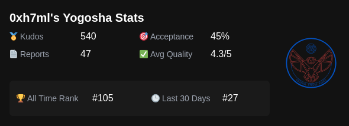

<div align="center">



## Yogosha Readme Stats

**Yogosha Readme Stats** card provides quick view of the researcher's statistics from the Yogosha platform, providing insights into their lastest activity and achievements. This stats card can be use in Github, blogs or personal websites.
</div>

## Usage
```

```

***Note**: Must keep your profile public.*